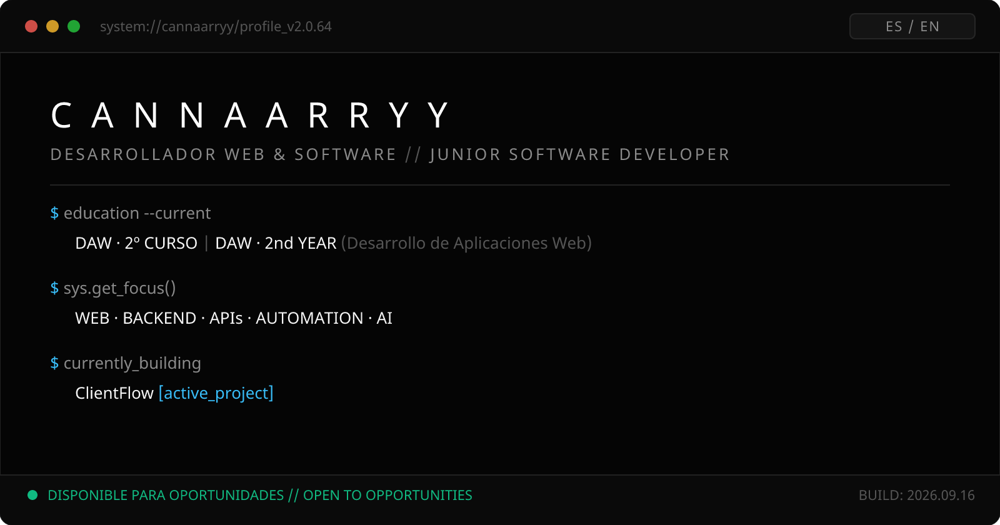
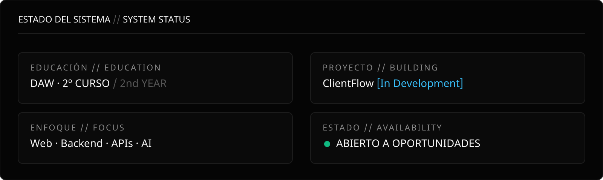
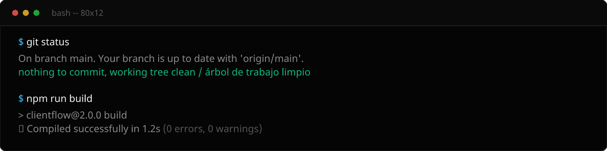
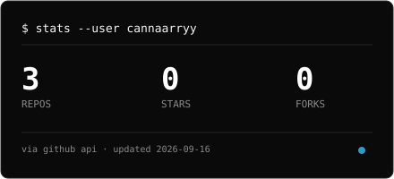
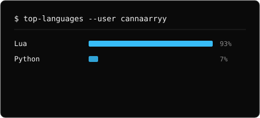
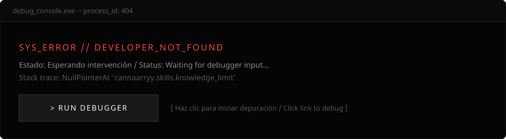
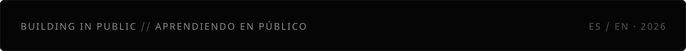

<!--
CANNAARRY GITHUB PROFILE · 2026
Junior Web / Software Developer | 2º DAW
Bilingual Profile: ES · EN
Dark · Premium · Minimal · Technical
-->

<b>Junior Web / Software Developer</b>

<b>2º DAW</b> · Backend · APIs · Automation Building real projects while studying.

 

<a href="#es--about-me">🇪🇸 ES</a> &nbsp;•&nbsp; <a href="#en--about-me">🇬🇧 EN</a>

---

## ES • ABOUT ME

Tengo 20 años y estudio el 2º año de DAW (Desarrollo de Aplicaciones Web) en España.

Me enfoco en **desarrollo web y software real** — trabajo con backends, APIs, bases de datos y sistemas de automatización. Mientras estudio, construyo proyectos prácticos y aprendo arquitectura profesional.

También tengo **experiencia práctica con FiveM** en Lua (Qbox, QBCore, ESX, ox_lib). Es parte de mi background técnico, pero estoy enfocado en construir una carrera como **Web / Software Developer**.

Junior pero **construyendo código real** y mejorando rápido.

---

## EN • ABOUT ME

I'm 20, studying 2nd year of DAW (Web Application Development) in Spain.

I focus on **real web and software development** — working with backends, APIs, databases, and automation systems. While I study, I build practical projects and learn professional architecture.

I also have **hands-on experience with FiveM** in Lua (Qbox, QBCore, ESX, ox_lib). It's part of my technical background, but I'm focused on building a career as a **Web / Software Developer**.

Junior but **shipping real code** and improving fast.

---

## ES • NAVEGACIÓN

[📋 Actualmente Construyendo](#es--actualmente-construyendo) • [🛠 Tech Stack](#es--tech-stack) • [📁 Proyectos](#es--proyectos-destacados) • [📊 Estadísticas](#es--estadísticas-github) • [🎯 Objetivos](#es--objetivos-actuales) • [📮 Contacto](#es--contacto)

## EN • NAVIGATION

[📋 Currently Building](#en--currently-building) • [🛠 Tech Stack](#en--tech-stack) • [📁 Projects](#en--featured-projects) • [📊 Stats](#en--github-stats) • [🎯 Goals](#en--current-goals) • [📮 Contact](#en--contact)

---

## SISTEMA DE ESTADO · SYSTEM STATUS

### ES • ESTADO ACTUAL

🇪🇸 2º DAW · construyendo ClientFlow · abierto a prácticas, junior y freelance

### EN • CURRENT STATUS

🇬🇧 DAW 2nd year · building ClientFlow · open to internships, junior roles and freelance

---

## ES • ACTUALMENTE CONSTRUYENDO

<!-- EDIT ME: cuando ClientFlow tenga repo público, sustituye el estado por su URL. -->

### ClientFlow
**Estado:** En desarrollo · Full-stack CRM
**Tech:** Web · Backend · Database

Aplicación full-stack de gestión de clientes. Estoy trabajando en arquitectura backend, API, base de datos y producto de principio a fin. El repositorio aún no es público.

`REPOSITORIO · PRÓXIMAMENTE`

---

## EN • CURRENTLY BUILDING

<!-- EDIT ME: when ClientFlow has a public repo, replace the status with its URL. -->

### ClientFlow
**Status:** In progress · Full-stack CRM
**Tech:** Web · Backend · Database

Full-stack client management app. Working on backend architecture, API, database and product end to end. The repository isn't public yet.

`REPOSITORY · COMING SOON`

---

## ES • PROYECTOS DESTACADOS

<!-- Solo repos verificados en github.com/cannaarryy. Notyx-logs NO tiene README en raíz: sin link de Detalles. -->

### NOTYX FPS BOOSTER
**Estado:** Activo
**Tipo:** FiveM · Lua

Menú optimizador de FPS para servidores FiveM. Cambia cielo, iluminación y filtros visuales. Presets configurables (ULTRA, RAPID, LOW, ORIGINAL) y FPS en tiempo real. Standalone y ligero.

**Tech:** Lua · ESX · QBCore · Qbox

[📂 Repositorio](https://github.com/cannaarryy/notyx-fps-booster) • [🔍 Detalles](https://github.com/cannaarryy/notyx-fps-booster/blob/main/README.md)

---

### NOTYX LOGS
**Estado:** Activo
**Tipo:** FiveM · Lua

Sistema de logs para servidores FiveM. Registra eventos del servidor.

**Tech:** Lua · FiveM

[📂 Repositorio](https://github.com/cannaarryy/Notyx-logs)

---

## EN • FEATURED PROJECTS

<!-- Only verified repos at github.com/cannaarryy. Notyx-logs has NO root README: no Details link. -->

### NOTYX FPS BOOSTER
**Status:** Active
**Type:** FiveM · Lua

FPS optimizer menu for FiveM servers. Changes sky, lighting and visual filters. Configurable presets (ULTRA, RAPID, LOW, ORIGINAL) with live FPS. Standalone, lightweight.

**Tech:** Lua · ESX · QBCore · Qbox

[📂 Repository](https://github.com/cannaarryy/notyx-fps-booster) • [🔍 Details](https://github.com/cannaarryy/notyx-fps-booster/blob/main/README.md)

---

### NOTYX LOGS
**Status:** Active
**Type:** FiveM · Lua

Logging system for FiveM servers. Records server events.

**Tech:** Lua · FiveM

[📂 Repository](https://github.com/cannaarryy/Notyx-logs)

---

## ES • TECH STACK

<!-- Stack listado = usado en proyectos o estudios DAW. Sin niveles inventados. -->

### LENGUAJES

| Lenguaje | Uso |
|----------|-----|
| **HTML · CSS · JavaScript** | Desarrollo web · DAW |
| **Lua** | FiveM · ESX · QBCore · Qbox |
| **Java** | Estudio en DAW |
| **SQL** | MySQL · Bases de datos |

### WEB · BACKEND

- **Node.js** (en aprendizaje)
- **Express** (en aprendizaje)
- **REST APIs** (diseño y consumo)

### BASE DE DATOS

- **MySQL** — diseño y consultas

### HERRAMIENTAS

- **Git** · **GitHub** — control de versiones
- **VS Code** — desarrollo

### FIVEM · LUA

- **Qbox** · **QBCore** · **ESX** — frameworks
- **ox_lib** · **ox_target** · **ox_inventory** — librerías

### AUTOMATIZACIÓN · IA

- APIs externas
- Scripts de automatización
- Integraciones IA (en aprendizaje)

---

## EN • TECH STACK

<!-- Listed stack = used in projects or DAW studies. No invented levels. -->

### LANGUAGES

| Language | Use |
|----------|-----|
| **HTML · CSS · JavaScript** | Web development · DAW |
| **Lua** | FiveM · ESX · QBCore · Qbox |
| **Java** | Study in DAW |
| **SQL** | MySQL · Databases |

### WEB · BACKEND

- **Node.js** (learning)
- **Express** (learning)
- **REST APIs** (design and consumption)

### DATABASE

- **MySQL** — design and queries

### TOOLS

- **Git** · **GitHub** — version control
- **VS Code** — development

### FIVEM · LUA

- **Qbox** · **QBCore** · **ESX** — frameworks
- **ox_lib** · **ox_target** · **ox_inventory** — libraries

### AUTOMATION · AI

- External APIs
- Automation scripts
- AI integrations (learning)

---

## ES • ESTADÍSTICAS GITHUB

<!-- Tarjetas generadas por .github/workflows/stats.yml con datos reales de
     GitHub API (sin servidores externos). Se regeneran a diario. -->

*Generado automáticamente con datos reales. El grafo de contribuciones nativo del perfil es la fuente de verdad.*

---

## EN • GITHUB STATS

<!-- Cards generated by .github/workflows/stats.yml with real GitHub API
     data (no external servers). Regenerated daily. -->

*Auto-generated with real data. This profile's native contribution graph is the source of truth.*

---

## ES • OBJETIVOS ACTUALES

- [ ] Completar 2º año de DAW
- [ ] Construir proyectos web/backend reales
- [ ] Mejorar arquitectura y buenas prácticas
- [ ] Mejorar APIs REST y bases de datos
- [ ] Explorar integraciones con IA
- [ ] Ganar experiencia profesional
- [ ] Desarrollar portfolio técnico

---

## EN • CURRENT GOALS

- [ ] Complete 2nd year of DAW
- [ ] Build real web/backend projects
- [ ] Improve architecture and good practices
- [ ] Improve REST APIs and databases
- [ ] Explore AI integrations
- [ ] Gain professional experience
- [ ] Develop technical portfolio

---

## DEBUG THE DEVELOPER

🇪🇸 ¿Algo roto? Abre un issue y lo depuramos &nbsp;·&nbsp; 🇬🇧 Something broken? Open an issue and we'll debug it

---

## ES • CONTACTO

Estoy abierto a prácticas, proyectos freelance y colaboraciones.

| Canal | Información |
|-------|-------------|
| **GitHub** | [@cannaarryy](https://github.com/cannaarryy) |
| **Portfolio** | `PRÓXIMAMENTE` |
| **LinkedIn** | `PRÓXIMAMENTE` |
| **Email** | `PRÓXIMAMENTE` |

[→ Abre un issue](https://github.com/cannaarryy/cannaarryy/issues) · [→ Envía un PR](https://github.com/cannaarryy/cannaarryy/pulls)

---

## EN • CONTACT

I'm open to internships, freelance projects, and collaborations.

| Channel | Information |
|---------|-------------|
| **GitHub** | [@cannaarryy](https://github.com/cannaarryy) |
| **Portfolio** | `COMING SOON` |
| **LinkedIn** | `COMING SOON` |
| **Email** | `COMING SOON` |

[→ Open an issue](https://github.com/cannaarryy/cannaarryy/issues) · [→ Send a PR](https://github.com/cannaarryy/cannaarryy/pulls)

---

<b>CONSTRUYENDO EN PÚBLICO · APRENDIENDO EN PROGRESO</b> <b>BUILDING IN PUBLIC · LEARNING IN PROGRESS</b>

<b>2026</b> · cannaarryy

© 2026 cannaarryy — All rights reserved.

<a href="https://github.com/cannaarryy">⬆ Volver al inicio / Back to top</a>

