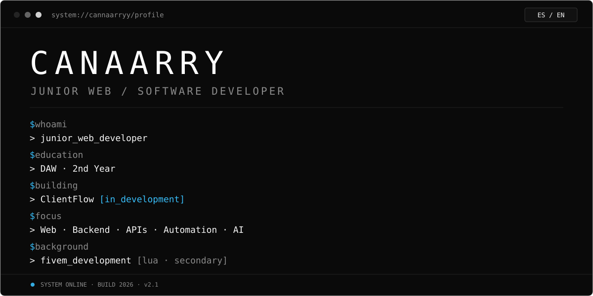
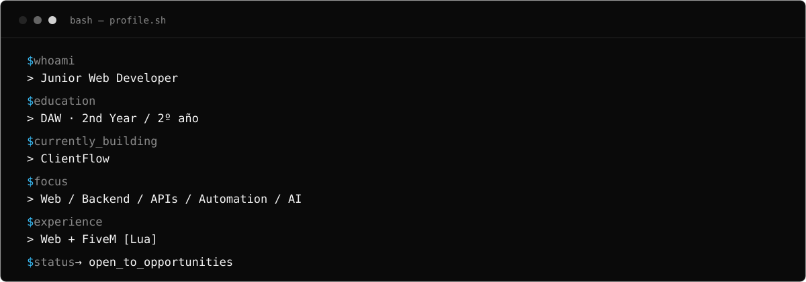
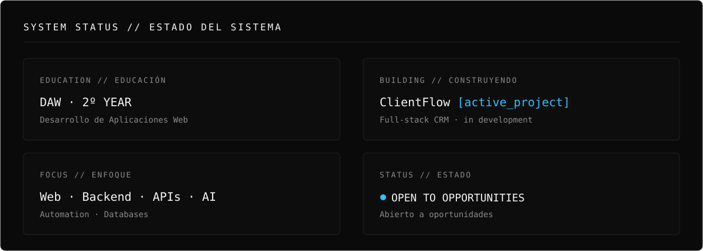
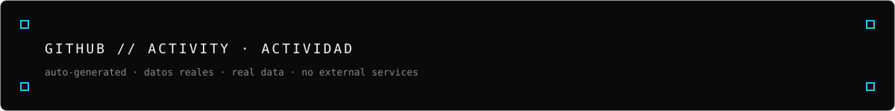
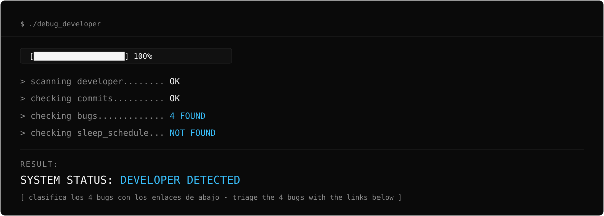
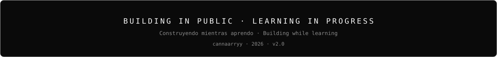

<!--
CANAARRY GITHUB PROFILE · v2.0 · 2026
Junior Web / Software Developer | 2º DAW
Bilingual Profile: ES · EN — Dark · Premium · Minimal · Technical
-->

<div align="center">



<p><sup><a href="#es--about-me">🇪🇸 ES</a> &nbsp;•&nbsp; <a href="#en--about-me">🇬🇧 EN</a></sup></p>

<p><sup>
<a href="#sobre-mí--about">about · sobre mí</a> ·
<a href="#terminal">terminal</a> ·
<a href="#estado-del-sistema--system-status">status · estado</a> ·
<a href="#construyendo--now-building">building</a> ·
<a href="#proyectos--projects">projects · proyectos</a> ·
<a href="#stack">stack</a> ·
<a href="#github--activity">activity · actividad</a> ·
<a href="#debug-the-developer">debug</a> ·
<a href="#objetivos--goals">goals · objetivos</a> ·
<a href="#contacto--contact">contact · contacto</a>
</sup></p>

</div>


## ES • ABOUT ME

Tengo 20 años y estudio DAW en 2º año. Estoy centrado en desarrollo web y software, trabajando con backend, APIs, bases de datos y automatización, mientras construyo proyectos prácticos para seguir mejorando.

También tengo experiencia práctica con FiveM en Lua (Qbox, QBCore, ESX, ox_lib): es parte de mi background, pero mi objetivo es crecer como Web / Software Developer.

## EN • ABOUT ME

I'm 20 years old and currently in my second year of DAW. My main focus is web and software development, working with backend systems, APIs, databases and automation while building practical projects to keep improving.

I also have hands-on experience with FiveM in Lua (Qbox, QBCore, ESX, ox_lib): it's part of my background, but my goal is to grow as a Web / Software Developer.


## TERMINAL

<sub>🇪🇸 Quién soy en 30 segundos · 🇬🇧 Who I am in 30 seconds</sub>

<div align="center">



</div>


## ESTADO DEL SISTEMA · SYSTEM STATUS

<div align="center">



</div>

<sub>🇪🇸 2º DAW · construyendo ClientFlow · abierto a prácticas, junior y freelance · 🇬🇧 DAW 2nd year · building ClientFlow · open to internships, junior roles and freelance</sub>


## CONSTRUYENDO · NOW BUILDING

<!-- EDIT ME: cuando ClientFlow tenga repo público, sustituye el estado por su URL / replace status with its URL. -->

### CLIENTFLOW — Full-stack CRM · `EN CONSTRUCCIÓN · BUILDING`

🇪🇸 Mi proyecto protagonista: un CRM full-stack para practicar arquitectura backend real — API, base de datos y producto de principio a fin. El repositorio aún no es público.

🇬🇧 My protagonist project: a full-stack CRM to practice real backend architecture — API, database and product end to end. The repository isn't public yet.

| | |
|---|---|
| **Estado · Status** | `EN CONSTRUCCIÓN · BUILDING` |
| **Objetivo · Goal** | CRM web completo · Complete web CRM |
| **Tech** | Web · Backend · Database |
| **Aprendiendo · Learning** | Arquitectura backend · APIs · Bases de datos · Backend architecture · APIs · Databases |
| **Repo** | `PRÓXIMAMENTE · COMING SOON` |


## PROYECTOS · PROJECTS

<!-- Solo repos verificados en github.com/cannaarryy. portfoliosjk no existe (404). -->
<!-- Only verified repos. Notyx-logs has NO root README: no Details link. -->

<sub>🇪🇸 Calidad sobre cantidad · 🇬🇧 Quality over quantity</sub>

<table>
<tr>
<td width="50%" valign="top">

### NOTYX FPS BOOSTER
<sub>FiveM · Lua · `ACTIVO · ACTIVE`</sub>
<br><br>
<sub>🇪🇸 Menú que optimiza FPS: presets visuales, filtros y FPS en tiempo real. Standalone y ligero.</sub>
<br>
<sub>🇬🇧 FPS optimizer menu: visual presets, filters and live FPS. Standalone, lightweight.</sub>
<br><br>
<sub>Stack: `Lua` · ESX / QBCore / Qbox</sub>
<br><br>
<a href="https://github.com/cannaarryy/notyx-fps-booster">→ VIEW PROJECT · VER PROYECTO</a>
<br>
<a href="https://github.com/cannaarryy/notyx-fps-booster/blob/main/README.md">→ Detalles · Details</a>

</td>
<td width="50%" valign="top">

### NOTYX LOGS
<sub>FiveM · Lua · `ACTIVO · ACTIVE`</sub>
<br><br>
<sub>🇪🇸 Sistema de logs del servidor: basic, chat, explosiones y txAdmin, con embeds de Discord.</sub>
<br>
<sub>🇬🇧 Server logging system: basic, chat, explosion and txAdmin logs with Discord embeds.</sub>
<br><br>
<sub>Stack: `Lua` · ox_lib · qbx/qb/esx</sub>
<br><br>
<a href="https://github.com/cannaarryy/Notyx-logs">→ VIEW PROJECT · VER PROYECTO</a>

</td>
</tr>
</table>


## STACK

<!-- Stack = usado en proyectos o estudios DAW. Sin niveles inventados. / Used in projects or DAW studies. -->

**LENGUAJES · LANGUAGES**
<br>
`HTML` `CSS` `JavaScript` `Java` `Lua` `SQL`

<br><br>

**WEB / BACKEND**
<br>
`Node.js` `Express` `REST APIs`

<br><br>

**BASE DE DATOS · DATABASE**
<br>
`MySQL`

<br><br>

**HERRAMIENTAS · TOOLS**
<br>
`Git` `GitHub` `VS Code`

<br><br>

**FIVEM**
<br>
`Qbox` `QBCore` `ESX` `ox_lib` `ox_target` `ox_inventory`

<br><br>

**AUTOMATIZACIÓN · IA · AUTOMATION · AI**
<br>
`APIs` `AI integrations` `Automation scripts`

<br>

<sub>🇪🇸 Listado = usado de verdad, no wishlist · 🇬🇧 Listed = actually used, not a wishlist</sub>


## GITHUB · ACTIVITY

<!-- Tarjetas generadas por .github/workflows/stats.yml con GitHub API real.
     Sin servidores externos. Se regeneran a diario. / No external servers. Regenerated daily. -->

<div align="center">



<br><br>


</div>

<sub>🇪🇸 Generado automáticamente con datos reales · 🇬🇧 Auto-generated with real data</sub>


## DEBUG THE DEVELOPER

<sub>🇪🇸 Algo está roto. Elige una hipótesis · 🇬🇧 Something is broken. Pick a hypothesis — sin JavaScript · no JavaScript, anchors only</sub>

<div align="center">

<a href="https://github.com/cannaarryy/cannaarryy/issues/new">

</a>

</div>

**[1] Missing semicolon → punto y coma perdido**
<br>
<sub>Revisa dónde se escribe código · Check where code is written →</sub> [`stack`](#stack)

<br><br>

**[2] Wrong API endpoint → endpoint equivocado**
<br>
<sub>Revisa dónde viven las rutas · Check where routes live →</sub> [`now building`](#construyendo--now-building)

<br><br>

**[3] Forgot to commit → olvidó commitear**
<br>
<sub>Revisa la evidencia · Check the evidence →</sub> [`activity`](#github--activity)

<br><br>

**[4] Works on my machine™ → en mi máquina funciona™**
<br>
<sub>La respuesta favorita de todo dev · Every dev's favorite answer →</sub> [`run diagnostics · ejecutar diagnóstico`](#debug-complete)

<br><br>

#### DEBUG COMPLETE

```text
✓ diagnosis finished — 0 bugs found

> 🇪🇸 No había ningún bug. Solo tenías que seguir bajando.
> 🇬🇧 There was no bug. You just kept scrolling.

hidden achievement unlocked: [CURIOUS]
```

<sub>→ [← back to debug · volver al debug](#debug-the-developer) · [contact](#contacto--contact)</sub>


## OBJETIVOS · GOALS

- Finalizar DAW · Finish DAW
- Construir proyectos reales · Build real projects
- Mejorar backend · Improve backend
- Mejorar arquitectura · Improve architecture
- Profundizar en APIs · Go deeper into APIs
- Aprender integración con IA · Learn AI integrations
- Crear automatizaciones · Build automation systems
- Conseguir experiencia profesional · Gain professional experience


## CONTACTO · CONTACT

<div align="center">

**HAGAMOS ALGO · LET'S BUILD SOMETHING**

<sub>🇪🇸 Estudiando, construyendo y abierto a freelance y colaboraciones · 🇬🇧 Studying, building, and open to freelance work and collaborations</sub>

<br><br>

| | |
|---|---|
| **GitHub** | https://github.com/cannaarryy |
| **Portfolio** | `PLACEHOLDER — añade la URL · add URL here` |
| **LinkedIn** | `PLACEHOLDER — añade la URL · add URL here` |
| **Email** | `PLACEHOLDER — añade el email · add email here` |

<br>

<!-- EDIT ME: al tener portfolio/linkedin/email, sustituye los PLACEHOLDER. / Replace PLACEHOLDERs when available. -->

<sub>🇪🇸 Recruiters, devs o owners: abrid un issue, un PR o saludad · 🇬🇧 Recruiters, devs or owners: open an issue, a PR, or just say hi</sub>

<br>

[→ Abre un issue · Open an issue](https://github.com/cannaarryy/cannaarryy/issues) · [→ PR](https://github.com/cannaarryy/cannaarryy/pulls)

</div>


<div align="center">



<p><sup>© 2026 cannaarryy — All rights reserved.</sup></p>
<p><sup><a href="https://github.com/cannaarryy">⬆ Volver al inicio / Back to top</a></sup></p>

</div>
